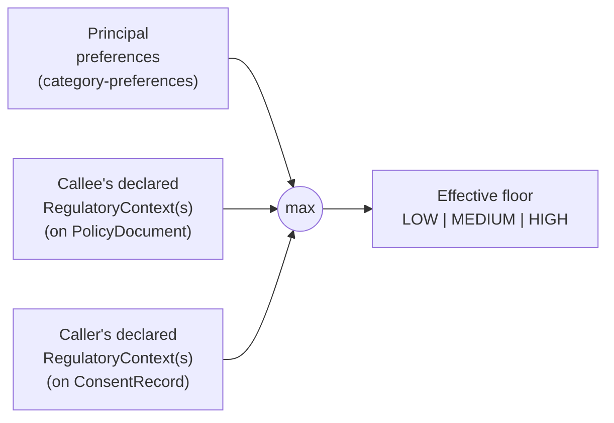

# Regulatory Context: Why This Extension Exists

This document explains the motivation for the regulatory-context
extension to the Agent Consent and Adherence Protocol (ACAP). Section 1
describes the delegation-of-obligation problem that any multi-party
agent deployment faces. Section 2 describes why Core alone and even
the category-preferences extension alone cannot represent
jurisdictional floors. Section 3 describes our approach: a
structure-not-content envelope that carries framework-specific
obligations on the same two-axis grid as principal preferences.
Section 4 compares the design against alternatives we considered.
Section 5 fences off what this extension does not attempt, with
particular care because this extension sits on legal territory.

## 1. The problem

None of [HIPAA](https://www.hhs.gov/hipaa/index.html),
[GDPR](https://gdpr-info.eu/),
[PCI-DSS](https://www.pcisecuritystandards.org/), the
[EU AI Act](https://digital-strategy.ec.europa.eu/en/policies/regulatory-framework-ai),
[CCPA](https://oag.ca.gov/privacy/ccpa),
[COPPA](https://www.ftc.gov/legal-library/browse/rules/childrens-online-privacy-protection-rule-coppa),
or [FINRA](https://www.finra.org/) governs agents directly. Each of
them governs *organizations*: covered entities and business
associates under HIPAA, data controllers and processors under GDPR,
merchants and service providers under PCI-DSS, providers and
deployers under the EU AI Act. The agent is never the regulated party.

So the agent has to behave *as if* it were subject to the framework,
because the compliance obligation flows through delegation. A hospital
deploying a scheduling agent inherits its
[HIPAA minimum-necessary](https://www.ecfr.gov/current/title-45/subtitle-A/subchapter-C/part-164/subpart-E/section-164.502)
obligations for anything the agent handles, regardless of what the
callee's `PolicyDocument` permits or what the principal personally
prefers. A European payments processor deploying a reconciliation
agent inherits its [GDPR Art. 28](https://gdpr-info.eu/art-28-gdpr/)
processor obligations. A consumer app deploying an AI chatbot
inherits its [EU AI Act Art. 50](https://artificialintelligenceact.eu/article/50/)
transparency obligations. The human's organization is the regulated party; the
agent is the delegated actor; the obligation travels from one to the
other through the consent chain.

The framework is a *floor*. A principal who personally does not care
whether their health data is stored long-term cannot lower the
HIPAA-imposed minimum for the hospital that employs the scheduling
agent. A callee that wants to share transaction data with an
advertising network cannot raise its claim above the PCI-DSS-imposed
minimum for the merchant it serves. The protocol must carry the
floor independently of what the principal and the callee individually
declare, and it must make the floor auditable.

## 2. Why core alone is insufficient

ACAP Core records what the caller accepted, what the callee declared,
and every per-claim adherence decision. It does not encode the
relationship either party has to a regulatory framework, because that
relationship is not a property of a single `ConsentRecord`: it is a
property of the *organization* behind the agent.

The category-preferences extension lets a principal express asymmetric
sensitivity across categories and dimensions, but the principal's
preference is by construction lowerable by the principal. A principal
who is casual about their own health data can set every cell to LOW.
Without a separate floor, a caller that honors the preference matrix
literally can end up below the regulatory minimum.

What neither Core nor category-preferences can do is carry the
obligation of a third party (the regulated organization) through a
two-party consent chain, and make its floor non-lowerable by the
principal. That is the gap this extension fills.

## 3. Our approach

We add a `RegulatoryContext` envelope that a callee attaches to the
`PolicyDocument` and a caller attaches to the `ConsentRecord`. Each
context declares:

  1. The `RegulatoryFramework`, which regime applies
  2. The declaring party's `role` under that regime (free-form string
     until a working group stabilizes a closed vocabulary)
  3. A list of `ComplianceObligation` entries, each pointing at a
     source article by reference and carrying the behavioral
     constraint it imposes as a `(affected_categories,
     affected_dimensions, minimum_sensitivity)` tuple on the ACAP grid

The mapping from a source article to the tuple is a *legal
determination*, not a protocol determination. That mapping is not part
of this extension.

The effective sensitivity for any `(category, dimension)` query is the
strictest element of the `LOW < MEDIUM < HIGH` lattice across every
declared source. The three sources and the composition are:

The operator is commutative and associative, so the order in which
the three sources are consulted does not affect the result. Adding a
fourth source (for example, a sector-specific voluntary code)
composes the same way.

Our approach has four practical properties that matter for deployment.

First, the floor is computed mechanically. Given a principal's
preference matrix and the declared regulatory contexts from both
parties, the effective sensitivity for any (category, dimension)
query is the strictest element of the LOW < MEDIUM < HIGH lattice
across all applicable sources. Two conformant implementations will
always agree on the floor for the same input, so an auditor can
re-run the computation from the stored record without replaying any
agent's internal reasoning.

Second, the envelope is additive, not replacing. A callee can declare
a HIPAA context and a principal can declare a GDPR context in the
same interaction, with the floor computed as the union of their
obligations. This matters because cross-jurisdictional deployments
are the norm, not the exception: a Canadian patient receives care
from a US covered entity through a European payments processor, and
all three frameworks apply simultaneously.

Third, the obligation reference is a string, not a closed enum. We
deliberately keep this string free-form so that the protocol can
point at [`HIPAA-164.502(a)`](https://www.ecfr.gov/current/title-45/subtitle-A/subchapter-C/part-164/subpart-E/section-164.502),
[`GDPR-Art.22(1)`](https://gdpr-info.eu/art-22-gdpr/), or a
hospital-internal `ACME-INT-POL-2024-03` without the protocol itself
needing to close the vocabulary. Auditors dereference the reference
out-of-band.

Fourth, the extension makes no claim that a carried context
*accurately represents* the named regulation. The validator enforces
structural well-formedness only, such that a context is
well-formed-but-incorrect if the human who authored it mis-translated
the regulation. Correctness is a legal review problem, not a
validator problem, and we keep the two concerns separate.

## 4. Alternatives considered

We considered four alternatives to the envelope approach before
settling on it.

**Baking frameworks into Core.** Core's `PolicyDocument` carries a
`jurisdictions` field already. We could extend that to a full
obligation matrix directly on Core. This fails the principle that
Core should be adoptable without jurisdiction-specific infrastructure:
many early adopters (internal agents at a single company, experimental
deployments) have no regulatory story at all, and Core should not
force one on them.

**Shipping reference HIPAA/GDPR/PCI-DSS mappings in this extension.**
We rejected this with unusual emphasis. Publishing a specific mapping
from, say,
[HIPAA §164.502](https://www.ecfr.gov/current/title-45/subtitle-A/subchapter-C/part-164/subpart-E/section-164.502)
to a (category, dimension, sensitivity) triple is a legal
determination. Shipping it in a protocol repository would invite
deployments to rely on it as authoritative, when in fact it would be
the output of an engineer reading statute text without the training
or the authority to produce such mappings. We explicitly list this
as "what will NOT ship without qualified review" in the extension's
STATUS document.

**Framework-specific sub-protocols.** Separate extensions per
framework, with bespoke schema per regulation. This shifts the legal
review problem to every framework individually, and prevents the
floor computation from composing across frameworks. Rejected in
favor of the single envelope that composes on the grid.

**Natural-language regulatory clauses interpreted at runtime.** The
callee declares "we are HIPAA covered entity" in prose and a language
model interprets the obligation at adherence time. Fails the audit
reproducibility test from Section 3: two models will interpret the
same statute differently, and no auditor can re-derive the floor from
a stored record. Out.

## 5. Out of scope

This extension sits close to legal territory, so the scope fence
matters. It does NOT ship any of the following:

  1. A normative mapping from a specific regulatory article to a
     `(category, dimension, sensitivity)` tuple. Every such mapping
     requires a qualified compliance engineer, healthcare-law
     specialist, data-protection lawyer, PCI-QSA, or equivalent
     professional to author and review.
  2. Any claim that a deployment carrying a given `RegulatoryContext`
     satisfies the named regulation.
  3. Any claim of endorsement by a regulator, bar association, or
     standards body.
  4. A vocabulary of valid `role` strings. The field remains free-form
     until a working group stabilizes one.
  5. A canonical list of `obligation_ref` values. References are
     out-of-band and maintained by the parties asserting them.
  6. Translation of regulation text into machine-readable form. The
     protocol provides the envelope; the translation is supplied by
     qualified domain specialists.

We are actively seeking collaborators for the mapping work: compliance
engineers, data-protection lawyers, healthcare regulatory specialists,
PCI-QSAs, and anyone who has worked on
[EU AI Act](https://artificialintelligenceact.eu/) deployer
obligations and would be interested in co-maintaining a mapping
library for one framework. The protocol can provide the structure to
carry such mappings without the mappings themselves being part of the
specification. That is the boundary this extension proposes to draw.

## References

The frameworks this extension's envelope is designed to carry:
[GDPR](https://gdpr-info.eu/),
[HIPAA](https://www.hhs.gov/hipaa/index.html),
[PCI-DSS](https://www.pcisecuritystandards.org/),
[CCPA](https://oag.ca.gov/privacy/ccpa),
[EU AI Act](https://digital-strategy.ec.europa.eu/en/policies/regulatory-framework-ai),
[COPPA](https://www.ftc.gov/legal-library/browse/rules/childrens-online-privacy-protection-rule-coppa),
[SOC 2](https://www.aicpa-cima.com/resources/landing/system-and-organization-controls-soc-suite-of-services),
[FINRA](https://www.finra.org/), plus sector-specific frameworks
such as [42 CFR Part 2](https://www.ecfr.gov/current/title-42/chapter-I/subchapter-A/part-2)
and [MiFID II](https://eur-lex.europa.eu/eli/dir/2014/65/oj). For the
Core ACAP specification this extension builds on, see the paper at
[Zenodo DOI 10.5281/zenodo.19606339](https://doi.org/10.5281/zenodo.19606339).
